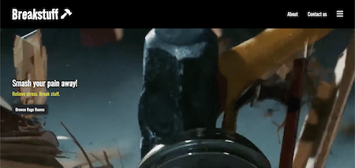
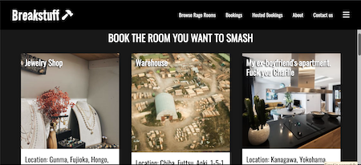
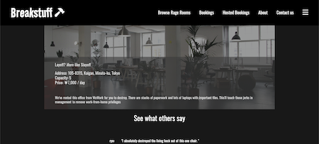

# 🔨 Breakstuff

Breakstuff is a "breakroom" simulation website.
Users can search for "breakrooms" to reserve for use (use in this case includes releasing stress by destroying everything!)

Users can also share their own breakrooms and upload photos / rooms for others to reserve. Room owners will be able to accept or reject reservation requests from other users.

This website is modelled on airbnb.


<br>

<br>

<br>
App home: https://breakstuff.herokuapp.com


## Getting Started
### Setup

Install gems
```
bundle install
```
Install JS packages
```
yarn install
```

### ENV Variables
Create `.env` file
```
touch .env
```
Inside `.env`, set these variables. For any APIs, see group Slack channel.
```
CLOUDINARY_URL=your_own_cloudinary_url_key

MAPBOX_API_KEY=your_own_mapbox_ap_key
```

### DB Setup
```
rails db:create
rails db:migrate
rails db:seed
```

### Run a server
```
rails s
```

## Built With
- [Rails 7](https://guides.rubyonrails.org/) - Backend / Front-end
- [Stimulus JS](https://stimulus.hotwired.dev/) - Front-end JS
- [Heroku](https://heroku.com/) - Deployment
- [PostgreSQL](https://www.postgresql.org/) - Database
- [Bootstrap](https://getbootstrap.com/) — Styling
- [Figma](https://www.figma.com) — Prototyping

## Acknowledgements
Inspired by Airbnb

## Team Members
- [Joe_Weber] (https://www.linkedin.com/in/jweber13/)
- [Ryo_Tamiya] (https://www.linkedin.com/in/ryo-tamiya-07832b8a/)
- [Mathieu_Belson] (https://www.linkedin.com/in/mathieu-belson-571a79145/)
- [Rashon_Rogers]

## Contributing
Pull requests are welcome. Please open an issue first to discuss what you would like to change.

## License
This project is licensed under the MIT License
